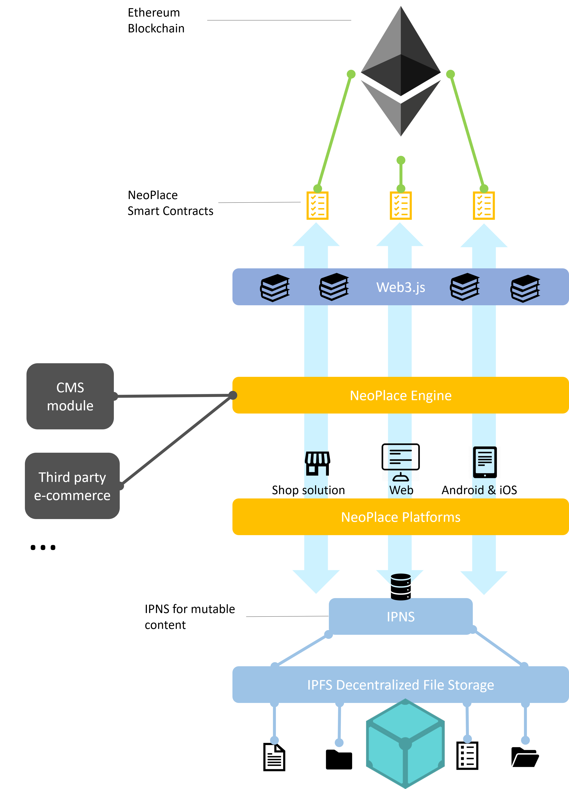
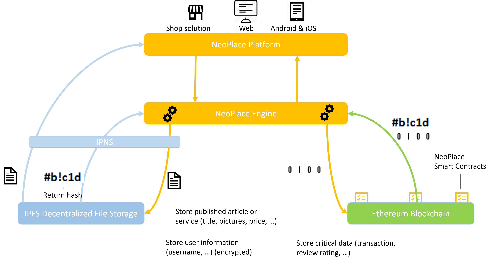

:warning: Repo under development :warning:
# Getting Started
## SCM

```
git clone https://github.com/NeoPlace/neoplace.core.git
```
Current branch is: master

## Prerequisites
Following development tools are required to run this project

```
* GIT
* IntelliJ IDEA / Visual Studio Code
* Node 8 with npm 5
* angular-cli
```

## Hierarchy
```
app
  app.component
  app.module
  ...           # entry point for angular app and configuration files
providers       # useful class
  model
  ...
package.json
README.md 
```

# Build

This project use npm and angular-cli >= 1.5.x for the build.
```
npm install
npm run build
or
npm start # if you want to test in live
```

# Architecture
We are building NeoPlace on top of Ethereum and IPFS.
## Global architecture



## How data is stored



## How data is structured
Your item or service is stored in JSON format in IPFS :
```
{ "item": {
    "id": "...";
    "title": "...";
    "subtitle": "...";
    "category": "...";
    "description": "...";
    "tags": ["...", "...", "..."];
    "gallery": ["<reference to another IPFS hash>", "...", "..."];
    "status": "...";
    "price": ...;
    "currency": "...";
    "brand": "...";
    "condition": "...";
    "userSeller": "..."
  }
}
```

# Wallet
## Wallet generation
### Bitcoin
```
var bitcoin = require("bitcoinjs-lib");
var keyPair = bitcoin.ECPair.makeRandom();
console.log(keyPair.getAddress());
console.log(keyPair.toWif());
// next step with BIP39
```

### Ethereum
```
var ethereumw = require('ethereumjs-wallet');
var wallet = ethereumw.generate();
console.log("wallet.getAddressString()");
console.log("wallet.getPrivateKeyString()");
// next step use https://github.com/ConsenSys/eth-lightwallet
```
### Neo
```
// we use libraries from Neo community: city of zion
var neon = require('@cityofzion/neon-js');
var privateKey = neon.create.privateKey();
var publicKey = neon.get.publicKeyFromPrivateKey(privateKey);
var scriptHash = neon.get.scriptHashFromPublicKey(publicKey);
var address = neon.get.addressFromScriptHash(scriptHash);
```
### Nem
```
const nem = require('nem-sdk').default;
var rBytes = nem.crypto.nacl.randomBytes(32);
var rHex = nem.utils.convert.ua2hex(rBytes);
var keypair = nem.crypto.keyPair.create(rHex);
var address = nem.model.address.toAddress(keypair.publicKey.toString(),  nem.model.network.data.mainnet.id)
```

### Stellar
```
const StellarSdk = require('stellar-sdk');
let keypair = StellarSdk.Keypair.random();
console.log(keypair.publicKey());
console.log(keypair.secret());
```

## How your wallet is encrypted
We use AES-256 (Advanced Encryption Standard), which is a symmetric encryption standard, to encrypt your wallet locally.
```
var CryptoJS = require("crypto-js");
 
// Encrypt
var encrypted = CryptoJS.AES.encrypt('YOUR WALLET'', 'secret key');
 
// Decrypt
var decrypted  = CryptoJS.AES.decrypt(encrypted.toString(), 'secret key');
var plaintext = decrypted.toString(CryptoJS.enc.Utf8);
```

## Escrow account
Currently a simple escrow system.
It will more and more sophisticated (integration jurors, community rewarded with NPT tokens)
### Ethereum
Embedded in smart contract
### Bitcoin
Multisig address
